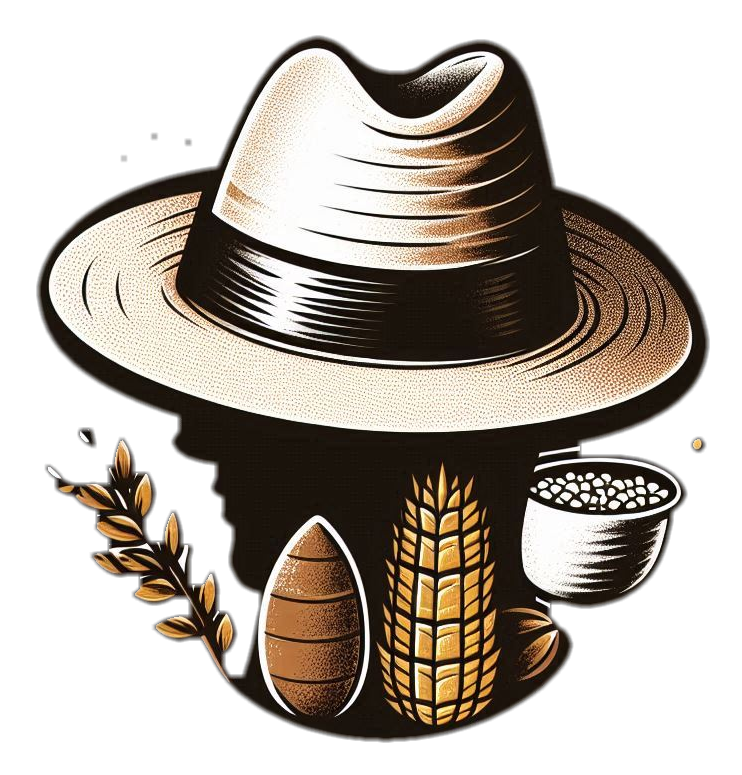
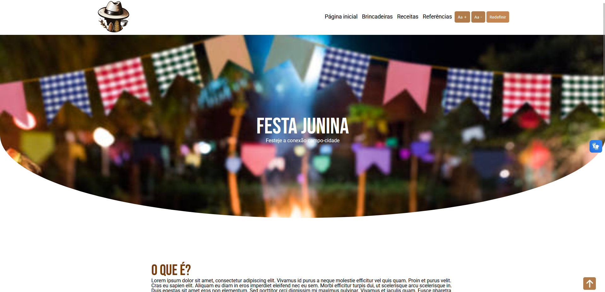

[JAVASCRIPT__BADGE]: https://img.shields.io/badge/Javascript-000?style=for-the-badge&logo=javascript

[CSS3]:https://img.shields.io/badge/css3-%231572B6.svg?style=for-the-badge&logo=css3&logoColor=white
[HTML5]: https://img.shields.io/badge/html5-%23E34F26.svg?style=for-the-badge&logo=html5&logoColor=white

 <h1 align="center" style="font-weight: bold;">Festa Junina 💻🪁: Festejando a conexão campo-cidade</h1> 

![javascript][JAVASCRIPT__BADGE]
![html][HTML5]
![css][CSS3]

  <a href="#about">Sobre o projeto</a> • 
  <a href="#started">Acessibilidade </a> • 
  <a href="#started">Navegação</a> •
  <a href="#started">Desenvolvedor</a>

    

<h2 id="started">📌 Sobre o projeto</h2>
O objetivo do projeto é promover a festa junina e reconhecer sua enorme importância à conexão entre o campo e a cidade

<h2 id="started">🚀 Acessibilidade</h2>
Atendendo manter o melhor conforto para os usuários, temos alguns auxiliadores no site:

<h3>Manipulação do tamanho de fontes</h3>
O usuário, por meio de botões, pode controlar o tamanho das fontes presentes no site.

<h3>Vlibras</h3>
Plug-in para traduzir texto em linguagem de sinais (LIBRAS).

<h3>Design responsivo</h3>
O site atende a todos os tamanhos de tela, trazendo conforto e evitando elementos mal posicionados na tela do usuário.

<h2 id="routes">📍Navegação</h2>

Here you can list the main routes of your API, and what are their expected request bodies.
​
| rotas               | descrição                                          
|----------------------|-----------------------------------------------------
| <kbd>/src/pages/receitas.html</kbd>     | Página de receitas de comidas típicas da festa junina
| <kbd>/src/pages/references.html</kbd>     |  Página de referencias de conteúdo
| <kbd>/src/pages/brincadeiras.html</kbd>     | Página de brincadeiras típicas da festa junina

<h2 id="colab">🤝 Desenvolvedor</h2>

Nome: Wesley Gonçalves Ribeiro

Professor: Rafael Zanchi de Souza

Instituição de ensino: Colégio Estadual do Paraná

Obrigado por acessar meu projeto!!

